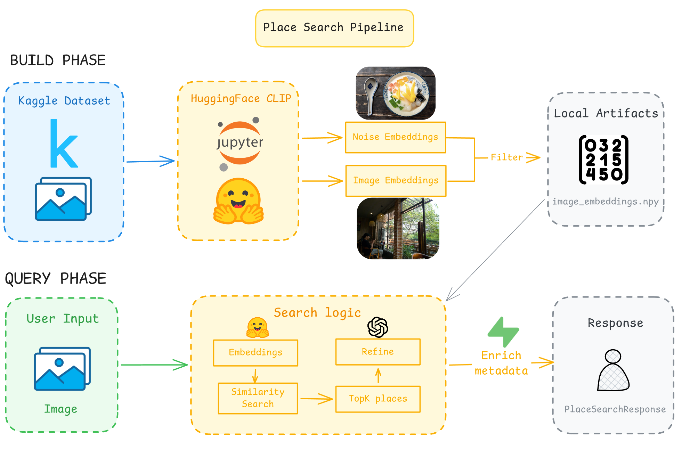

# Place Search Service

## 🎯 Mục đích

`place-search-service` là FastAPI service tìm địa điểm bằng ảnh. Service này sở hữu CLIP model runtime, image embedding, noise filtering, similarity search và optional LLM refinement.

## 🧩 Trách nhiệm

- Nhận ảnh upload từ backend.
- Validate ảnh đầu vào.
- Tạo embedding ảnh bằng CLIP.
- Đọc runtime artifacts từ root `data/`.
- Phát hiện ảnh nhiễu/không phù hợp bằng noise embeddings.
- Tính similarity giữa ảnh upload và image embeddings đã build trước.
- Gộp kết quả theo `place_id`.
- Enrich metadata từ Supabase hoặc fallback local `places.json`.
- Refine output theo `target_language` nếu OpenAI được cấu hình.

Runtime dùng artifacts đã build sẵn trong root `data/` và trả kết quả theo request hiện tại.

## 🔌 Public API

| Method | Path | Mô tả |
| --- | --- | --- |
| `GET` | `/health` | Health check. |
| `POST` | `/v1/place-search/by-image` | Nhận field `file`, query `target_language`, trả danh sách địa điểm tương tự. |

Swagger:

```text
http://localhost:8102/docs
```

## 🧠 Cấu trúc

```text
place-search-service/
|-- app/
|   |-- main.py              # FastAPI app
|   |-- routes.py            # HTTP routes
|   |-- schemas.py           # Request/response models
|   |-- config.py            # Env config
|   |-- dependencies.py      # Lazy service dependencies
|   |-- image_upload.py      # Upload validation
|   |-- search_engine.py     # CLIP model + similarity search
|   |-- pipeline.py          # Request orchestration
|   |-- supabase_client.py   # Optional metadata enrichment
|   |-- refinement.py        # Optional OpenAI refinement
|   `-- prompts.py           # Refinement prompts
|-- research/
|-- tests/
|-- requirements.txt
|-- requirements-dev.txt
|-- Dockerfile
|-- place_search.png
`-- .env.example
```

Pipeline:



Runtime query flow:

```text
backend multipart upload
  -> /v1/place-search/by-image
  -> image validation
  -> CLIP image embedding
  -> noise similarity check
  -> image similarity search
  -> place grouping + Supabase/local enrichment
  -> optional OpenAI refinement
  -> JSON response
```

Artifact flow hiện tại:

```text
Kaggle/local image dataset
  -> research notebook / embedding pipeline
  -> noise embeddings + image embeddings
  -> root data/
  -> runtime place search
```

## 🔗 Dependencies

- FastAPI, Pydantic, Uvicorn.
- Pillow, NumPy.
- Transformers/Hugging Face CLIP model: `laion/CLIP-ViT-H-14-laion2B-s32B-b79K` by default.
- Supabase optional metadata enrichment.
- OpenAI optional result refinement.
- Root `data/` artifacts.
- Docker volume `huggingface_cache` khi chạy bằng Docker Compose.

Backend là consumer runtime chính. `data-engineering/` và notebook research là nguồn tạo artifacts.

## ⚙️ Configuration

Tạo `.env`:

```bash
cd ai-models/place-search-service
cp .env.example .env
```

Biến chính:

- `SERVICE_HOST`, `SERVICE_PORT`, `SERVICE_TOKEN`
- `MAX_UPLOAD_SIZE_MB`
- `PLACE_SEARCH_MODEL_NAME`
- `PLACE_SEARCH_EMBEDDINGS_PATH`
- `PLACE_SEARCH_INDEX_PATH`
- `PLACE_SEARCH_PLACES_PATH`
- `PLACE_SEARCH_NOISE_EMBEDDINGS_PATH`
- `PLACE_SEARCH_NOISE_INDEX_PATH`
- `PLACE_SEARCH_NOISE_THRESHOLD`
- `PLACE_SEARCH_TOP_K_IMAGES`
- `PLACE_SEARCH_MIN_SIMILARITY`
- `PLACE_SEARCH_USE_GPU`
- `HF_TOKEN`, `HF_HUB_DISABLE_XET`
- `SUPABASE_URL`, `SUPABASE_SERVICE_KEY`
- `OPENAI_API_KEY`, `OPENAI_REFINE_MODEL`

Runtime artifacts mặc định:

```text
data/
|-- image_embeddings.npy
|-- image_index.json
|-- places.json
|-- noise_embeddings.npy
`-- noise_index.json
```

## 🚀 Ví dụ sử dụng

Chạy local:

```bash
cd ai-models/place-search-service
python3 -m venv .venv
source .venv/bin/activate
pip install -r requirements-dev.txt
uvicorn app.main:app --reload --host localhost --port 8102
```

Gọi API:

```bash
curl -X POST "http://localhost:8102/v1/place-search/by-image?target_language=vi" \
  -F "file=@/path/to/place-image.jpg"
```

## 🧪 Testing

```bash
cd ai-models/place-search-service
python -m pytest -q
python -m compileall -q app
```

Test hiện tại nên ưu tiên mock model/artifacts để không tải model lớn trong CI.

## 🧱 Extension guide

Đổi model embedding:

1. Cập nhật `PLACE_SEARCH_MODEL_NAME`.
2. Regenerate toàn bộ `image_embeddings.npy` và `noise_embeddings.npy` bằng cùng model.
3. Kiểm tra lại similarity threshold và noise threshold.
4. Cập nhật README/research note với model version.

Thêm metadata field:

1. Cập nhật `places.json` hoặc Supabase query.
2. Cập nhật response schema trong `app/schemas.py`.
3. Cập nhật backend/frontend contract nếu field được hiển thị.

## ⚠️ Lưu ý

- Model CLIP lần đầu tải có thể lâu và tốn dung lượng cache.
- Embeddings phải được build bằng đúng model runtime; đổi model mà không rebuild artifacts sẽ làm similarity sai.
- Root `data/` là dependency runtime bắt buộc ở phase hiện tại.
- Supabase không khả dụng thì service fallback sang `places.json`.
- Threshold quá thấp sẽ trả nhiều kết quả nhiễu; threshold quá cao dễ không có kết quả.
