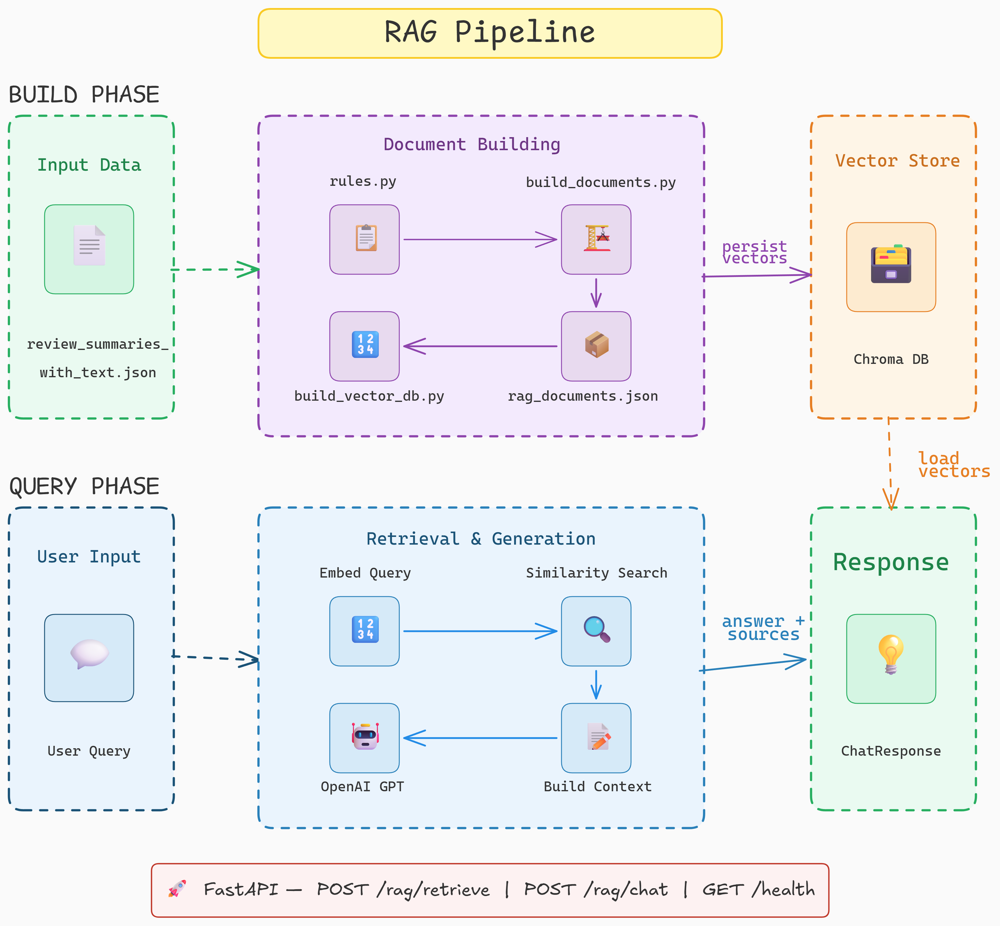

# RAG Service

## 🎯 Mục đích

`rag-service` là FastAPI service cho chatbot gợi ý địa điểm. Service này sở hữu retrieval từ Chroma vector DB, prompt generation bằng OpenAI và refinement endpoint dùng chung.

## 🧩 Trách nhiệm

- Build RAG documents từ review summary offline output.
- Build/query Chroma vector DB.
- Retrieve địa điểm liên quan theo câu hỏi.
- Generate câu trả lời theo `target_language` (`vi` hoặc `en`).
- Trả sources để frontend hiển thị/trace kết quả.
- Cung cấp endpoint refinement dùng chung cho nội dung AI.

Chat history và user auth được xử lý ở backend/frontend.

## 🔌 Public API

| Method | Path | Mô tả |
| --- | --- | --- |
| `GET` | `/health` | Health check. |
| `POST` | `/v1/rag/retrieve` | Vector search, trả source places. |
| `POST` | `/v1/rag/chat` | Retrieve + generate answer. |
| `POST` | `/v1/refinement/refine` | Refine/chuyển ngữ nội dung dùng chung. |

Swagger:

```text
http://localhost:8103/docs
```

## 🧠 Cấu trúc

```text
rag-service/
|-- app/
|   |-- main.py            # FastAPI app
|   |-- routes.py          # RAG/refinement routes
|   |-- schemas.py         # Request/response models
|   |-- config.py          # Env config
|   |-- rag_engine.py      # Chroma + embedding retrieval
|   |-- service.py         # Chat orchestration
|   |-- refinement.py      # Shared refinement logic
|   `-- prompts.py         # RAG/refinement prompts
|-- build_documents.py
|-- build_vector_db.py
|-- query_rag.py
|-- rules.py
|-- rag_pipeline.png
|-- rag_documents.json
|-- chroma_db/
|-- tests/
|-- requirements.txt
|-- requirements-dev.txt
|-- Dockerfile
`-- .env.example
```

Pipeline:



Runtime:

```text
backend /api/v1/rag/chat
  -> /v1/rag/chat
  -> Chroma retrieval
  -> OpenAI answer generation
  -> optional refinement
  -> answer + sources
```

Artifact build:

```text
review_summaries_with_text.json
  -> build_documents.py
  -> rag_documents.json
  -> build_vector_db.py
  -> chroma_db/
```

## 🔗 Dependencies

- FastAPI, Pydantic, Uvicorn.
- ChromaDB for vector store.
- SentenceTransformer/Hugging Face embedding model, default `AITeamVN/Vietnamese_Embedding`.
- OpenAI for answer generation/refinement.
- Review summary offline output as source data.
- Docker volume `huggingface_cache` khi chạy bằng Docker Compose.

Backend RAG feature là consumer runtime chính. Review summary offline pipeline là data producer chính.

## ⚙️ Configuration

Tạo `.env`:

```bash
cd ai-models/rag-service
cp .env.example .env
```

Biến chính:

- `SERVICE_HOST`, `SERVICE_PORT`, `SERVICE_TOKEN`
- `OPENAI_API_KEY`
- `OPENAI_MODEL`
- `OPENAI_REFINE_MODEL`
- `RAG_COLLECTION_NAME`
- `RAG_CHROMA_DIR`
- `RAG_EMBEDDING_MODEL`
- `RAG_EMBEDDING_DEVICE`
- `RAG_NO_RESULTS_MESSAGE`
- `HF_TOKEN`
- `HF_HUB_DISABLE_XET`

`RAG_CHROMA_DIR` trong Docker Compose trỏ tới `/workspace/ai-models/rag-service/chroma_db`.

## 🚀 Ví dụ sử dụng

Chạy local:

```bash
cd ai-models/rag-service
python3 -m venv .venv
source .venv/bin/activate
pip install -r requirements-dev.txt
uvicorn app.main:app --reload --host localhost --port 8103
```

Build artifacts:

```bash
python build_documents.py
python build_vector_db.py
```

Gọi chat endpoint:

```bash
curl -X POST http://localhost:8103/v1/rag/chat \
  -H "Content-Type: application/json" \
  -d '{"message":"Suggest me natural vibe coffees at Thu Duc","top_k":3,"target_language":"en"}'
```

## 🧪 Testing

```bash
cd ai-models/rag-service
python -m pytest -q
python -m compileall -q app
```

Smoke test retrieval thủ công:

```bash
python query_rag.py
```

## 🧱 Extension guide

Thay đổi nguồn dữ liệu:

1. Cập nhật logic trong `build_documents.py`.
2. Regenerate `rag_documents.json`.
3. Rebuild `chroma_db/` bằng `build_vector_db.py`.
4. Smoke test bằng `/v1/rag/retrieve` trước khi test `/v1/rag/chat`.

Thay đổi prompt:

1. Cập nhật `app/prompts.py`.
2. Kiểm tra cả `target_language=vi` và `target_language=en`.
3. Test câu hỏi có/không có nguồn phù hợp.

## ⚠️ Lưu ý

- `rag_documents.json`, `chroma_db/` và `RAG_EMBEDDING_MODEL` phải đồng bộ.
- Nếu query không retrieve đúng source, LLM có thể trả câu trả lời chung chung.
- RAG trả lời dựa trên dữ liệu đã index trong `chroma_db/`.
- Embedding model lần đầu tải có thể lâu.
- Chat history được xử lý bởi backend/frontend.
