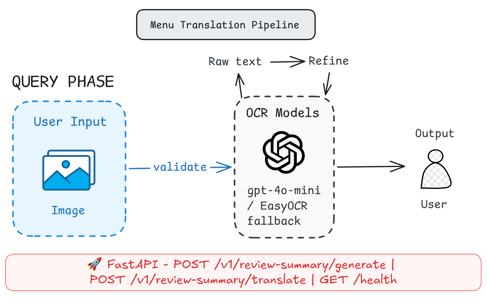

# Review Summary Service

## 🎯 Mục đích

`review-summary-service` là FastAPI service sinh hoặc dịch tổng quan đánh giá cho một địa điểm. Service này sở hữu prompt review summary và OpenAI runtime. Offline pipeline nằm trong `offline/`.

## 🧩 Trách nhiệm

- Generate summary từ tên địa điểm, tỷ lệ sentiment và keywords.
- Translate summary có sẵn sang `vi` hoặc `en`.
- Giữ output format đủ nhất quán để frontend hiển thị.
- Tách runtime service và offline batch pipeline.
- Cung cấp API nội bộ cho backend review-summary feature.

Backend chuẩn bị dữ liệu review/summary rồi gọi service qua HTTP.

## 🔌 Public API

| Method | Path | Mô tả |
| --- | --- | --- |
| `GET` | `/health` | Health check. |
| `POST` | `/v1/review-summary/generate` | Sinh summary mới theo `target_language`. |
| `POST` | `/v1/review-summary/translate` | Dịch summary hiện có theo `target_language`. |

Swagger:

```text
http://localhost:8104/docs
```

## 🧠 Cấu trúc

```text
review-summary-service/
|-- app/
|   |-- main.py          # FastAPI app
|   |-- routes.py        # HTTP routes
|   |-- schemas.py       # Request/response models
|   |-- config.py        # Env config
|   |-- llm.py           # OpenAI client wrapper
|   |-- service.py       # Generate/translate orchestration
|   `-- prompts.py       # Review summary prompts
|-- offline/             # Batch pipeline cùng domain
|-- tests/
|-- requirements.txt
|-- requirements-dev.txt
|-- requirements-offline.txt
|-- Dockerfile
`-- .env.example
```

Runtime flow:

```text
backend review-summary route
  -> Supabase summary/review data
  -> /v1/review-summary/generate hoặc /translate
  -> OpenAI
  -> localized summary text
```

Offline flow:

```text
offline/data/input
  -> offline/scripts
  -> offline/data/intermediate
  -> offline/data/output
  -> backend fallback / RAG document build
```

Sơ đồ offline pipeline: 

## 🔗 Dependencies

- FastAPI, Pydantic, Uvicorn.
- OpenAI for summary generation/translation.
- Backend review-summary feature là consumer runtime.
- `offline/` pipeline tạo dữ liệu nền cho backend fallback và RAG.

## ⚙️ Configuration

Tạo `.env`:

```bash
cd ai-models/review-summary-service
cp .env.example .env
```

Biến chính:

- `SERVICE_HOST`, `SERVICE_PORT`, `SERVICE_TOKEN`
- `OPENAI_API_KEY`
- `OPENAI_REFINE_MODEL`
- `DATABASE_URL` cho offline pipeline

Online runtime chỉ cần OpenAI/service config. Offline scripts dùng thêm `DATABASE_URL`.

## 🚀 Ví dụ sử dụng

Chạy local:

```bash
cd ai-models/review-summary-service
python3 -m venv .venv
source .venv/bin/activate
pip install -r requirements-dev.txt
uvicorn app.main:app --reload --host localhost --port 8104
```

Generate summary:

```bash
curl -X POST http://localhost:8104/v1/review-summary/generate \
  -H "Content-Type: application/json" \
  -d '{"place_name":"Haidilao Hot Pot","positive_ratio":0.97,"negative_ratio":0.02,"positive_keywords":["friendly staff","delicious food"],"negative_keywords":["expensive"],"target_language":"en"}'
```

## 🧪 Testing

```bash
cd ai-models/review-summary-service
python -m pytest -q
python -m compileall -q app
```

Offline pipeline .

## 🧱 Extension guide

Thay đổi format summary:

1. Cập nhật prompt trong `app/prompts.py`.
2. Cập nhật schema nếu response contract thay đổi.
3. Test cả `target_language=vi` và `target_language=en`.
4. Kiểm tra frontend rendering với summary dài/ngắn.

Thêm field đầu vào:

1. Cập nhật `app/schemas.py`.
2. Cập nhật backend client/schema tương ứng.
3. Giữ field optional nếu cần backward compatibility.

## ⚠️ Lưu ý

- Review summary quality phụ thuộc mạnh vào keyword/ratio từ offline pipeline.
- English output có thể ngắn hơn Vietnamese nếu prompt không ép đủ chi tiết; cần test cả hai ngôn ngữ khi sửa prompt.
- Thiếu dữ liệu summary thường cần kiểm tra backend Supabase query hoặc offline output.
- `DATABASE_URL` trong `.env.example` phục vụ offline scripts.
