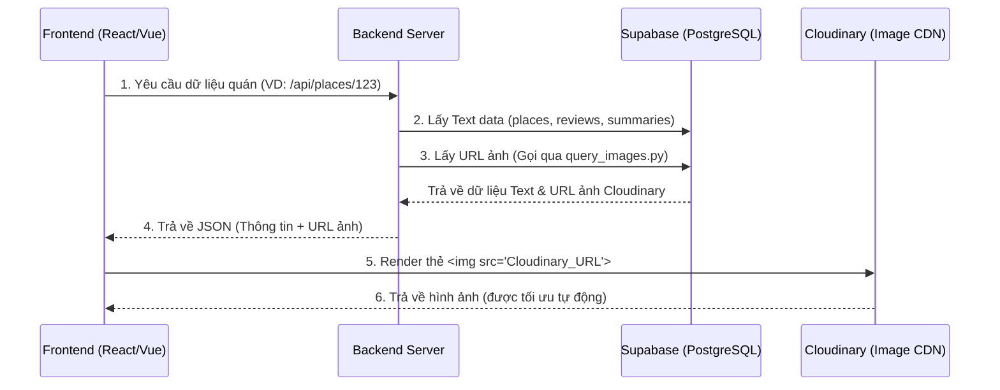

# Hướng Dẫn Tích Hợp Dữ Liệu - Smart Tourism

Tài liệu này tóm tắt toàn bộ quy trình thiết lập, quản lý và sử dụng **Dữ liệu**. Các script liên quan được lưu trong thư mục `scripts/`.

---

## 1. Thiết Lập Môi Trường
1. **Cài đặt thư viện:**  
   Chạy lệnh: `pip install -r requirements.txt` (hoặc cài các gói chính như `supabase`, `cloudinary`, `fastapi`, `uvicorn`, `python-dotenv`, `pandas`).
2. **Cấu hình `.env`:**  
   Tạo file `.env` ở thư mục gốc (ngang hàng `data-engineering`) chứa các biến môi trường:
   ```ini
   # Supabase
   SUPABASE_URL=https://<your-project>.supabase.co
   SUPABASE_KEY=<your-anon-key>

   # Cloudinary
   CLOUDINARY_URL=cloudinary://<API_KEY>:<API_SECRET>@<CLOUD_NAME>
   ```

---

## 2. Cấu Trúc Database (Supabase)
Dự án sử dụng PostgreSQL trên Supabase. Dưới đây là các bảng chính và mục đích:
- `places`: Lưu thông tin quán ăn/địa điểm (ID, Tên, Địa chỉ, Tọa độ, Đánh giá trung bình...).
- `reviews`: Lưu các bài đánh giá chi tiết (User, Rating, Text, Thời gian).
- `image_embeddings`: Lưu URL hình ảnh (lưu trên Cloudinary) kèm theo Vector (1024 chiều) để tìm kiếm AI.
- `place_summaries`: Lưu kết quả AI tóm tắt đánh giá của từng quán, cảm xúc chung (sentiment) và từ khóa.

*(Lưu ý: Script khởi tạo Schema chi tiết đã được chạy trên server Supabase).*

---

## 3. Quy Trình Đồng Bộ Dữ Liệu (Data Pipeline)
Thứ tự thực thi các file Python trong thư mục `scripts/`:

1. **`extract_dataset.py` / `inspect_kaggle_data.py`:**  
   Dùng để giải nén và kiểm tra dữ liệu thô tải từ Kaggle về máy.
2. **`kaggle_to_supabase.py`:**  
   Đẩy dữ liệu dạng Text (Bảng `places` và `reviews`) lên Supabase.
3. **`upload_images_cloudinary.py`:**  
   Tự động upload hình ảnh trong máy lên CDN Cloudinary (chạy multi-thread để tăng tốc). Trả về URL ảnh để chèn vào DB.
4. **`push_embeddings.py`:**  
   Đọc file Vector (ảnh đã qua AI embedding) và đẩy lên bảng `image_embeddings` trên Supabase (cột `embedding` type `halfvec`).
5. **`push_summaries.py`:**  
   Đẩy dữ liệu AI Tóm tắt (Bảng `place_summaries`) lên Supabase.

---

## 4. Quy Trình Hoạt Động (Architecture Flow)

Dưới đây là sơ đồ luồng dữ liệu giải thích cách Frontend (FE) và Backend (BE) giao tiếp với hệ thống dữ liệu:



---

## 5. Hướng Dẫn Truy Xuất Dữ Liệu (Access Guide)

### Backend

**1. Lấy dữ liệu Text (Places, Reviews, Summaries):**
Tương tác trực tiếp với Supabase thông qua thư viện Python:

```python
import os
from supabase import create_client, Client
from dotenv import load_dotenv

load_dotenv()
supabase: Client = create_client(os.environ.get("SUPABASE_URL"), os.environ.get("SUPABASE_KEY"))

# Ví dụ lấy thông tin 1 quán
res = supabase.table("places").select("*").eq("place_id", "ChIJxxx").execute()
print(res.data)
```

**2. Lấy dữ liệu Hình Ảnh (Image URLs):**
Đã viết sẵn API xử lý ảnh trong file **`scripts/query_images.py`**. Backend có thể import trực tiếp các hàm này hoặc chạy nó như một Microservice (FastAPI):

- **Khởi động server riêng:** `python scripts/query_images.py`
- **Các API endpoints (Cổng 8000):**
  - `GET /api/images/{image_id}`: Lấy 1 ảnh cụ thể.
  - `GET /api/images?ids=id1&ids=id2`: Lấy nhiều ảnh cùng lúc.
  - `GET /api/places/{place_id}/image/random`: Lấy ngẫu nhiên 1 ảnh của quán để làm Thumbnail.

### Frontend

FE **không gọi trực tiếp** vào Supabase hay DB mà sẽ nhận dữ liệu JSON từ Backend (bao gồm các đường dẫn URL ảnh của Cloudinary). 

Để hiển thị ảnh, FE chỉ cần dùng thẻ `` với `src` là URL Cloudinary nhận được.
Ví dụ URL gốc BE trả về:
`https://res.cloudinary.com/demo/image/upload/v1234/sample.jpg`


